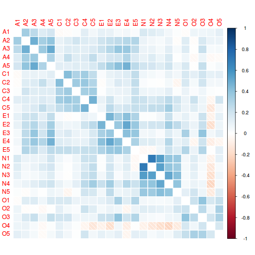
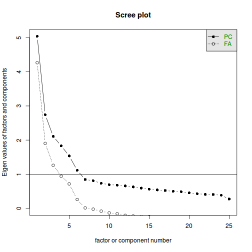
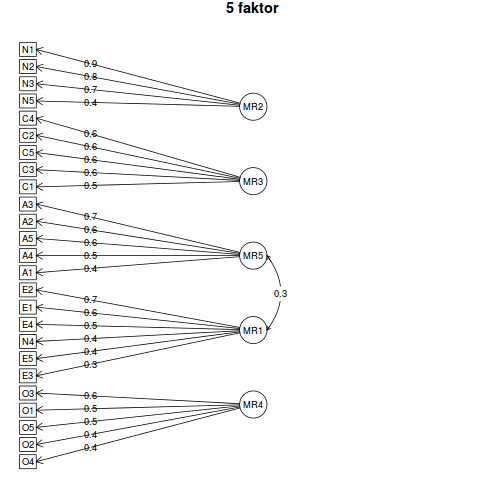
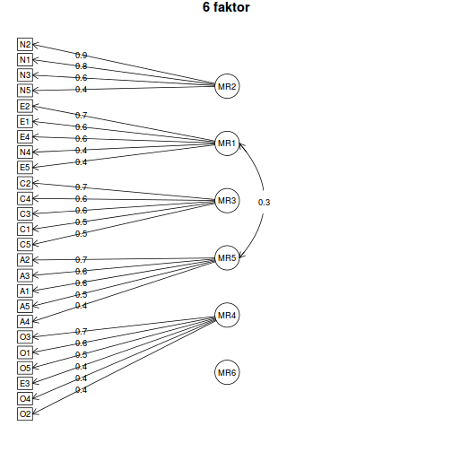

# Exploratív faktorelemzés

A példában a *psych* csomag 'bfi' példaadatát fogjuk használni, amely
egy személyiségkérdőív 25 itemére kapott válaszait (N=2800) tartalmazza, illetve
néhány demográfiai változót. 
A kapcsolódó 'bfi.dictionary' adatframe 'Keying' változója tartalmazza, hogy 
a 25 item közül melyek voltak fordított itemek. A 25 item elvileg 5 faktort
mér (A: Agreeableness, C: Conscientiousness, E: Extraversion, N: Neuroticism, 
and O: Opennness). 

- töltsük be a *psyh* csomagot, vizsgáljuk meg a 'bfi' és 'bfi.dictionary' 
adatokat:

```r
# csomag betöltése
library(psych)

# a bfi és bfi.dictionary leírása
?bfi

# a bfi első néhány sora
head(bfi)
```

```
##       A1 A2 A3 A4 A5 C1 C2 C3 C4 C5 E1 E2 E3 E4 E5 N1 N2 N3 N4 N5 O1 O2 O3
## 61617  2  4  3  4  4  2  3  3  4  4  3  3  3  4  4  3  4  2  2  3  3  6  3
## 61618  2  4  5  2  5  5  4  4  3  4  1  1  6  4  3  3  3  3  5  5  4  2  4
## 61620  5  4  5  4  4  4  5  4  2  5  2  4  4  4  5  4  5  4  2  3  4  2  5
## 61621  4  4  6  5  5  4  4  3  5  5  5  3  4  4  4  2  5  2  4  1  3  3  4
## 61622  2  3  3  4  5  4  4  5  3  2  2  2  5  4  5  2  3  4  4  3  3  3  4
## 61623  6  6  5  6  5  6  6  6  1  3  2  1  6  5  6  3  5  2  2  3  4  3  5
##       O4 O5 gender education age
## 61617  4  3      1        NA  16
## 61618  3  3      2        NA  18
## 61620  5  2      2        NA  17
## 61621  3  5      2        NA  17
## 61622  3  3      1        NA  17
## 61623  6  1      2         3  21
```

```r
# a bfi.dictionary struktúrája
str(bfi.dictionary)
```

```
## 'data.frame':	28 obs. of  7 variables:
##  $ ItemLabel: Factor w/ 376 levels "q_101","q_1020",..: 95 32 40 66 84 42 291 308 309 211 ...
##  $ Item     : Factor w/ 377 levels "Accept people as they are.",..: 34 204 212 232 247 22 99 115 116 355 ...
##  $ Giant3   : Factor w/ 3 levels "Cohesion","Plasticity",..: 1 1 1 1 1 3 3 3 3 3 ...
##  $ Big6     : Factor w/ 6 levels "Agreeableness",..: 1 1 1 1 1 2 2 2 2 2 ...
##  $ Little12 : Factor w/ 12 levels "Assertiveness",..: 4 4 4 4 4 10 10 10 7 7 ...
##  $ Keying   : int  -1 1 1 1 1 1 1 1 -1 -1 ...
##  $ IPIP100  : Factor w/ 6 levels "B5:A","B5:C",..: 1 1 1 1 1 2 2 2 2 2 ...
```

- fordítsuk át a fordított itemeket:

```r
# készítsünk egy új adattáblát, hogy ne az eredetit írjuk majd 
# felül a következő lépésekben (ez nem feltétlenül kötelező)
items <- 1:25
dat <- bfi[, items]

# átfordítandó itemek 
items_to_flip <- bfi.dictionary$Keying[items] < 0

# a leírásból kiderült, hogy az itemeket 6 fokozatú skálán
# mérték; ez alapján a fordítás menete:
dat[, items_to_flip] <- 7 - dat[, items_to_flip]
```

- ellenőrizzük, hogy az egyes itemekre adott válaszok
a vártnak megfelelően korrelálnak egymással; az itemek nagy száma miatt
érdemes vizualizálni a korrelációs mátrixot (ehhez használjuk a *corrplot* 
csomag `corrplot()` függvényét):

```r
# a korrelációs mátrix (a hiányzó értékek miatt megváltoztatjuk 
# a 'use' argumentumot, lásd ?cor)
corrs <- cor(dat, use = "pairwise")

# a 'corrplot' csomag príma ilyen feladatra
library(corrplot)

# a corrplot() függvény rengeteg argumentummal rendelkezik,
# érdemes elolvasni a függvény súgóját (?corrplot)
corrplot(corrs, method = "shade", diag = FALSE)
```



A korrelációs ábrán jól látszik, hogy a A, C, E, N faktorok itemei viszonylag
erősen korrelálnak egymással, az O faktor itemei viszont kevésbé meggyőzőek. 
Továbbá az A és E itemek között számottevő együttjárás tapasztalható, azaz
ezek a faktorok valószínűleg nem függetlenek egymástól. (Megjegyzés: olvasd
el a `?polychoric` függvény súgóját, hogy a Pearson-korreláció helyett 
milyen korrelációt érdemes számolni dichotóm vagy néhány válaszlehetőséget 
tartalmazó itemek esetében. A példában vizsgált adatoknál a polychoric 
korreláció szinte teljesen megegyezik a Pearson-korrelációval.)

Az exploratív faktorelemzés egyik lényeges kérdése, hogy hány faktorra van
szükség a változók közötti együttjárás mintázatának kellően pontos leírására. 

- a faktorszám megállapításának egyik módszere a "scree plot" (az optimális 
szám ott található, ahol a sajátértékeket ábrázoló görbe "megtörik"):

```r
scree(dat)
```



- egy modernebb módszer a párhuzamos elemzés (parallel analysis):

```r
fa.parallel(dat)
```


```
## Parallel analysis suggests that the number of factors =  6  and the number of components =  6
```

A fentebbi elemzések alapján kétséges, hogy valóban ötfaktoros szerkezetű-e a
vizsgált kérdőív. Mivel az A és E faktorok a korrelációs vizsgálatunk alapján 
korrelálnak egymással, a faktorelemzésnél érdemes ferde forgatást alkalmazni.
A *psych* csomag `fa()` függvény alapbeállításként ilyen forgatást (egész 
pontosan 'oblimin' forgatást) alkalmaz.

- ötfaktoros megoldás:

```r
fa5 <- fa(dat, nfactors = 5)
```

```
## Loading required namespace: GPArotation
```

```r
print(fa5)
```

```
## Factor Analysis using method =  minres
## Call: fa(r = dat, nfactors = 5)
## Standardized loadings (pattern matrix) based upon correlation matrix
##      MR2   MR3   MR5   MR1   MR4   h2   u2 com
## A1  0.20 -0.04  0.36 -0.14  0.04 0.15 0.85 2.0
## A2  0.02  0.09  0.60 -0.01  0.03 0.40 0.60 1.1
## A3  0.03  0.03  0.67  0.07  0.04 0.51 0.49 1.0
## A4  0.06  0.20  0.46  0.04 -0.15 0.29 0.71 1.7
## A5  0.14  0.00  0.58  0.17  0.06 0.48 0.52 1.3
## C1 -0.06  0.53  0.00 -0.05  0.16 0.32 0.68 1.2
## C2 -0.13  0.64  0.11 -0.13  0.06 0.43 0.57 1.2
## C3 -0.04  0.56  0.11 -0.08 -0.06 0.32 0.68 1.1
## C4  0.12  0.64 -0.06  0.04  0.03 0.47 0.53 1.1
## C5  0.14  0.57 -0.01  0.16 -0.10 0.43 0.57 1.4
## E1 -0.09 -0.10  0.10  0.56  0.11 0.37 0.63 1.3
## E2  0.06  0.03  0.09  0.67  0.07 0.55 0.45 1.1
## E3 -0.06 -0.02  0.30  0.34  0.31 0.44 0.56 3.0
## E4  0.00  0.01  0.36  0.53 -0.05 0.52 0.48 1.8
## E5 -0.18  0.27  0.08  0.39  0.22 0.40 0.60 3.1
## N1  0.85 -0.01  0.09 -0.09  0.05 0.71 0.29 1.1
## N2  0.82 -0.02  0.08 -0.04 -0.01 0.66 0.34 1.0
## N3  0.67  0.06 -0.10  0.14 -0.03 0.53 0.47 1.2
## N4  0.41  0.16 -0.09  0.42 -0.08 0.48 0.52 2.4
## N5  0.44  0.02 -0.22  0.25  0.14 0.34 0.66 2.4
## O1  0.01  0.06  0.02  0.06  0.53 0.32 0.68 1.1
## O2  0.16  0.10 -0.21 -0.03  0.44 0.24 0.76 1.9
## O3 -0.01  0.00  0.09  0.10  0.63 0.47 0.53 1.1
## O4 -0.08 -0.04  0.14 -0.36  0.38 0.26 0.74 2.4
## O5  0.11  0.05 -0.10 -0.07  0.52 0.27 0.73 1.2
## 
##                        MR2  MR3  MR5  MR1  MR4
## SS loadings           2.49 2.05 2.10 2.07 1.64
## Proportion Var        0.10 0.08 0.08 0.08 0.07
## Cumulative Var        0.10 0.18 0.27 0.35 0.41
## Proportion Explained  0.24 0.20 0.20 0.20 0.16
## Cumulative Proportion 0.24 0.44 0.64 0.84 1.00
## 
##  With factor correlations of 
##      MR2  MR3  MR5  MR1  MR4
## MR2 1.00 0.21 0.03 0.23 0.01
## MR3 0.21 1.00 0.20 0.22 0.20
## MR5 0.03 0.20 1.00 0.31 0.23
## MR1 0.23 0.22 0.31 1.00 0.17
## MR4 0.01 0.20 0.23 0.17 1.00
## 
## Mean item complexity =  1.6
## Test of the hypothesis that 5 factors are sufficient.
## 
## The degrees of freedom for the null model are  300  and the objective function was  7.23 with Chi Square of  20163.79
## The degrees of freedom for the model are 185  and the objective function was  0.63 
## 
## The root mean square of the residuals (RMSR) is  0.03 
## The df corrected root mean square of the residuals is  0.04 
## 
## The harmonic number of observations is  2762 with the empirical chi square  1474.6  with prob <  1.3e-199 
## The total number of observations was  2800  with MLE Chi Square =  1749.88  with prob <  1.4e-252 
## 
## Tucker Lewis Index of factoring reliability =  0.872
## RMSEA index =  0.055  and the 90 % confidence intervals are  0.053 0.057
## BIC =  281.47
## Fit based upon off diagonal values = 0.98
## Measures of factor score adequacy             
##                                                 MR2  MR3  MR5  MR1  MR4
## Correlation of scores with factors             0.93 0.88 0.88 0.88 0.85
## Multiple R square of scores with factors       0.86 0.77 0.78 0.78 0.72
## Minimum correlation of possible factor scores  0.73 0.54 0.56 0.56 0.44
```

- hatfaktoros megoldás:

```r
fa6 <- fa(dat, nfactors = 6)
print(fa6)
```

```
## Factor Analysis using method =  minres
## Call: fa(r = dat, nfactors = 6)
## Standardized loadings (pattern matrix) based upon correlation matrix
##      MR2   MR1   MR3   MR5   MR4   MR6   h2   u2 com
## A1  0.10 -0.11 -0.08  0.56 -0.05  0.28 0.33 0.67 1.7
## A2 -0.04  0.03  0.07  0.69  0.00  0.06 0.50 0.50 1.0
## A3  0.01  0.12  0.03  0.62  0.06 -0.10 0.51 0.49 1.2
## A4  0.07  0.06  0.20  0.39 -0.11 -0.15 0.28 0.72 2.2
## A5  0.16  0.21  0.01  0.45  0.12 -0.21 0.48 0.52 2.3
## C1 -0.01 -0.05  0.55 -0.06  0.18 -0.07 0.35 0.65 1.3
## C2 -0.06 -0.13  0.68  0.01  0.11 -0.17 0.50 0.50 1.3
## C3 -0.01 -0.06  0.55  0.09 -0.05 -0.04 0.31 0.69 1.1
## C4  0.05  0.08  0.63  0.07 -0.06  0.30 0.55 0.45 1.5
## C5  0.14  0.19  0.54  0.01 -0.11  0.07 0.43 0.57 1.5
## E1 -0.13  0.59 -0.11  0.12  0.09  0.08 0.38 0.62 1.3
## E2  0.05  0.69  0.01  0.07  0.06  0.03 0.55 0.45 1.1
## E3  0.00  0.35  0.01  0.15  0.39 -0.21 0.48 0.52 2.9
## E4  0.05  0.55  0.03  0.19  0.03 -0.29 0.56 0.44 1.8
## E5 -0.17  0.41  0.26  0.07  0.22  0.02 0.40 0.60 2.9
## N1  0.85 -0.09  0.00  0.06  0.05  0.00 0.70 0.30 1.0
## N2  0.85 -0.04 -0.01  0.02  0.01 -0.08 0.69 0.31 1.0
## N3  0.64  0.15  0.04 -0.07 -0.06  0.11 0.52 0.48 1.2
## N4  0.39  0.44  0.13 -0.07 -0.11  0.09 0.48 0.52 2.5
## N5  0.40  0.25  0.00 -0.16  0.09  0.20 0.35 0.65 2.8
## O1  0.05  0.05  0.08 -0.04  0.56 -0.03 0.34 0.66 1.1
## O2  0.11 -0.01  0.07 -0.08  0.37  0.35 0.29 0.71 2.4
## O3  0.02  0.10  0.02  0.03  0.66  0.00 0.48 0.52 1.1
## O4 -0.08 -0.35 -0.02  0.15  0.38  0.02 0.25 0.75 2.4
## O5  0.03 -0.06  0.02  0.05  0.45  0.40 0.37 0.63 2.1
## 
##                        MR2  MR1  MR3  MR5  MR4  MR6
## SS loadings           2.42 2.22 2.04 1.88 1.67 0.83
## Proportion Var        0.10 0.09 0.08 0.08 0.07 0.03
## Cumulative Var        0.10 0.19 0.27 0.34 0.41 0.44
## Proportion Explained  0.22 0.20 0.18 0.17 0.15 0.07
## Cumulative Proportion 0.22 0.42 0.60 0.77 0.93 1.00
## 
##  With factor correlations of 
##       MR2   MR1  MR3   MR5   MR4   MR6
## MR2  1.00  0.25 0.18  0.10 -0.02  0.18
## MR1  0.25  1.00 0.22  0.31  0.19 -0.06
## MR3  0.18  0.22 1.00  0.20  0.19  0.03
## MR5  0.10  0.31 0.20  1.00  0.25 -0.15
## MR4 -0.02  0.19 0.19  0.25  1.00 -0.02
## MR6  0.18 -0.06 0.03 -0.15 -0.02  1.00
## 
## Mean item complexity =  1.7
## Test of the hypothesis that 6 factors are sufficient.
## 
## The degrees of freedom for the null model are  300  and the objective function was  7.23 with Chi Square of  20163.79
## The degrees of freedom for the model are 165  and the objective function was  0.36 
## 
## The root mean square of the residuals (RMSR) is  0.02 
## The df corrected root mean square of the residuals is  0.03 
## 
## The harmonic number of observations is  2762 with the empirical chi square  660.84  with prob <  1.6e-60 
## The total number of observations was  2800  with MLE Chi Square =  1013.9  with prob <  4.4e-122 
## 
## Tucker Lewis Index of factoring reliability =  0.922
## RMSEA index =  0.043  and the 90 % confidence intervals are  0.04 0.045
## BIC =  -295.76
## Fit based upon off diagonal values = 0.99
## Measures of factor score adequacy             
##                                                 MR2  MR1  MR3  MR5  MR4
## Correlation of scores with factors             0.93 0.89 0.88 0.87 0.85
## Multiple R square of scores with factors       0.87 0.80 0.78 0.77 0.73
## Minimum correlation of possible factor scores  0.73 0.59 0.56 0.53 0.46
##                                                 MR6
## Correlation of scores with factors             0.77
## Multiple R square of scores with factors       0.59
## Minimum correlation of possible factor scores  0.18
```

- ábrázolás:

```r
fa.diagram(fa5, main = "5 faktor")
```



```r
fa.diagram(fa6, main = "6 faktor")
```



Látható, hogy a 6 faktoros megoldás jobb illeszkedést mutat az 5 faktorosnál,
de a 6. faktor súlyai nagyon alacsonyak. Emellett az 5 faktoros megoldás jól
értelmezhető, és teljesen összhangban van a kérdőív feltételezett faktorstruktúrájával.


