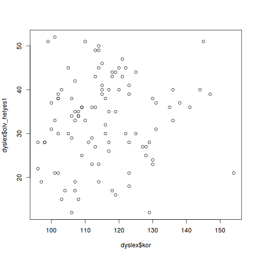
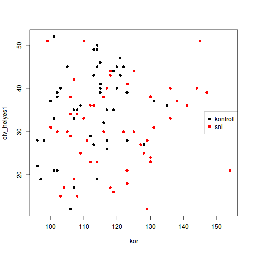
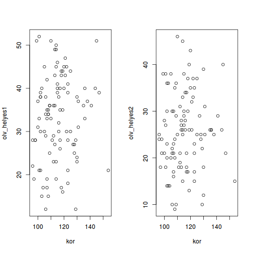
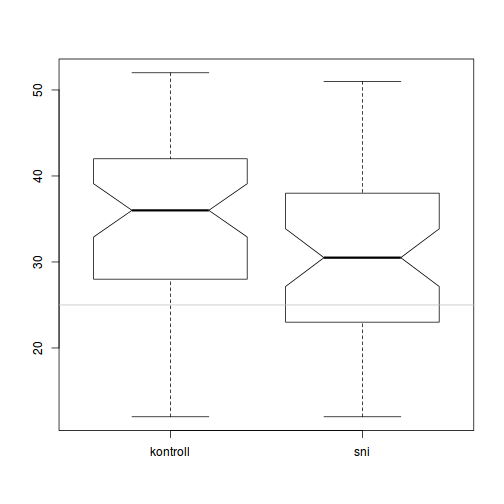
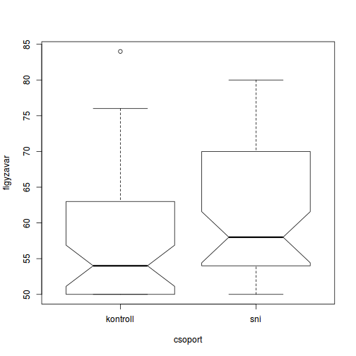
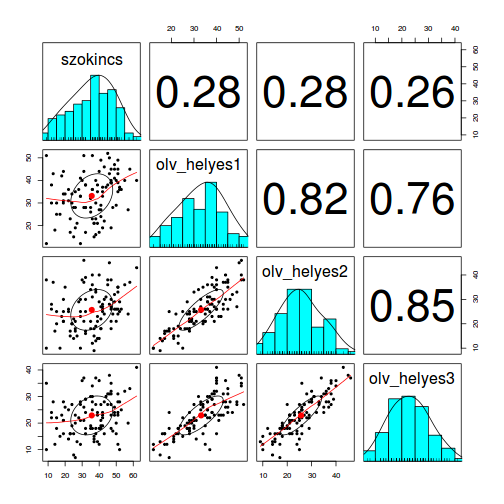

# Base graphics

A base graphics az R legrégebbi ábrázolási rendszere. Alapvetően statikus
ábrák készítésére alkalmas, és igen apró részletekig paraméterezhető. 

A base graphics ábrázolási modellje a "festő modellt" (paint model) követi, azaz
az ábrakészítés lépései többnyire a következők:

1. A "vászon" (canvas) előkészítése és valamilyen magas szintű ábrázoló rutin
segítségével a fő ábra elkészítése.
2. Az ábra kiegészítése kiegészítő pontokkal, vonalakkal, szöveggel stb., amely alacsonyabb szintű rutinok meghívásával történik.
3. Az egyes lépések során (a vászon felosztásától kezdve a tengely-feliratok
formázásáig) szinte minden elem megjelenését egyedileg kontrollálhatjuk.


A base graphics fő függvénye a `plot` és a paraméterek beállítására szolgáló 
`par`. A `plot` függvény valójában egy generikus függvény, rendkívül sok specifikus
metódussal (lásd `methods(plot)`). Alapesetben a `plot.default` metódust
hívjuk meg. Külön függvények léteznek hisztogramok (`hist`), boxplotok 
(`boxplot`), oszlopdiagramok (`barplot`), vonalábrák (`matplot`), színkódolt
felület-ábrák (`image`) stb. megjelenítésére. Alacsonyabb szintű függvényekkel
pontokat (`points`), vonalakat (`abline`, `lines`, `segments`), alakzatokat (`polygon`),
szöveget (`text`, `mtext`), ábramagyarázatot (`legend`) stb. adhatunk az ábrához.

A következőkben bemutatunk néhány gyakran használt ábratípust. A base graphics
valamennyi ábrázoló függvényének megtekintéséhez írd be ezt a sort a 
konzolba: `library(help = "graphics")`. _Nagyon ajánlott_ elolvasni a hivatalos 
R-es bevezető dokumentum vonatkozó részét is (lásd pl. [itt](https://cran.r-project.org/doc/manuals/R-intro.html#Graphics)).

### Scatterplot

- töltsük be a diszlexiás adatainkat (ezek már olyan adatok, amelyekben 
a változók típusát megfelelően beállítottuk)

```r
data(dyslex)
```

- ábrázoljuk az x tengelyen az életkort, az y tengelyen a helyesen olvasott 
szavak számát

```r
# alap megadási mód
plot(dyslex$kor, dyslex$olv_helyes1) 
```



```r
# a with() függvényt használva, külön színnel jelölve a két csoportot, és
# megváltoztatva a pontok alakját
with(dyslex,
     plot(kor, olv_helyes1, col = csoport, pch = 16))

# tegyünk hozzá ábramagyarázatot
legend("right", legend = levels(dyslex$csoport),
       col = c("black", "red"), pch = 16)
```



- ahogyan a modellezés során, a `plot` függvénynél is használhatjuk a `formula`
interfészt; a formula általános alakja: függő változó ~ magyarázó változó
- bolondítsuk meg az egészet azzal, hogy felosztjuk a vászont két részre, és 
tegyünk egymás mellé egy-egy ábrát a kor & olv_helyes1, illetve a kor & olv_helyes2 változók összefüggéséről

```r
# a par() függvény 'mfrow' argumentumának megadjuk, hogy 1 sorra és 2 
# oszlopra ossza fel az ábrázolási területet
par(mfrow = c(1, 2))

# első mező feltöltése egy ábrával, formula-t használva
plot(olv_helyes1 ~ kor, data = dyslex)

# masodik mező feltöltése egy ábrával, formula-t használva
plot(olv_helyes2 ~ kor, data = dyslex)
```



### Boxplot

A box & whisker ábra nagyon jó és robusztus módszer arra, hogy ábrázoljuk egy 
folytonos változó eloszlását egy csoportosító változó függvényében.

- ábrázoljuk az olv_helyes1 változó eloszlását a csoport (kontroll/sni) 
függvényében

```r
# notch-ot is tegyünk rá, lásd ?boxplot
boxplot(olv_helyes1 ~ csoport, data = dyslex, notch = TRUE)

# húzzunk egy vízszintes vonalat az olv_helyes2 mediánjának megfelelően
abline(h = median(dyslex$olv_helyes2), col = "grey")
```



- ábrázoljuk a figyelemzavar változó eloszlását a csoport (kontroll/sni) 
függvényében, azonosítsuk az outlier-t

```r
# a plot() automatikusan a boxplot()-ot jelenti, ha az x változó faktor!
plot(figyzavar ~ csoport, data = dyslex, notch = TRUE)
with(dyslex, identify(csoport, figyzavar))
```



```
## integer(0)
```

```r
dyslex[25, ]
```

```
##     id nem  csoport oszt kor figyzavar szokincs olv_helyes1 olv_helyes2
## 25 s25 fiu kontroll    3 114        84       42          19          25
##    olv_helyes3 sp_helyes1 sp_helyes2 sp_helyes3 sp_helyes4 sp_helyes5
## 25          24         24         15         15         14         16
##    olvasas helyesiras
## 25      68         84
```

### Ábra mentése külső fájlba

Valójában a grafikai eszköz, amely az ábrát megjeleníti, nem csak a 
képernyődön megnyíló ablak (vagy RStudio-nal a Plots window) lehet. 
Szabadon megválaszthatod, hogy az ábrát milyen eszközön akarod elkészíteni,
lásd: `?device`. Például készítsünk egy pdf-et a korábbi boxplot-os 
ábrából:


```r
# ha az ű és í nem jól jelenne meg, az alábbi paranccsal kiküszöbölheted
pdf.options(encoding = "CP1250")

# nyitunk egy pdf grafikai eszközt, megadjuk a fájl nevét, az ábra méretét
pdf(file = "temp.pdf", width = 7, height = 7)

# elkészítjük az ábrát
plot(figyzavar ~ csoport, data = dyslex, notch = TRUE)

# bezárjuk az eszközt
dev.off()
```

Ezek után a kérdéses fájl (temp.pdf) ott pihen a munkakönyvtáradban.

(Az RStudio Plots nevet viselő ablakában lehetőséged van arra, hogy az aktuális
ábrát akár valamilyen bitmap, akár pdf formátumba exportáld. Ez sajnos nem
mindig működik tökéletesen, illetve humán interakciót igényel, így például
szkripteket futtatva nem használható.)


### Base graphics ábrák a különböző csomagokban

Nagyon valószínű, hogy valaki már megírta az a plottoló rutint, amelyet használni szeretnél, így érdemes először keresni, és csak utána feltalálni a kereket.

Sajnos egy ideje nem frissül, de 
[ezen a linken](http://rgm3.lab.nig.ac.jp/RGM/) találhatsz egy egész mutatós  kollekciót R-ábrákból.

Explorációs ábrázolásokra (különösen regressziós elemzések előtt) kiválóan 
alkalmas például a *psych* csomag `pairs.panels` függvénye:


```r
library(psych)
pairs.panels(
    dyslex[, c("szokincs", "olv_helyes1", "olv_helyes2", "olv_helyes3")])
```



