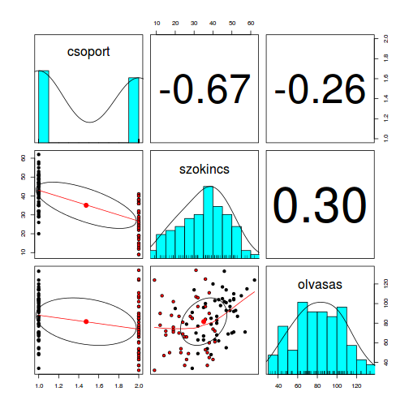

# Leíró statisztikák

- újfent a már jólismert olvasásvizsgálati adatokkal fogunk dolgozni

```r
# példaadat betöltése
data(dyslex)
```

- szűrjük le a legfeljebb 4. osztályos tanulókra a mintát, és válasszuk ki
a releváns változókat

```r
dat <- subset(dyslex, 
              oszt <= 4, 
              select = c(csoport, szokincs, olvasas)
              )
```


- ha az adatstruktúra `data.frame`, a `summary()` függvény meghívásával
számos alapvető leíró statisztikát kapunk vissza (melyek mindegyike a válasz
osztályához igazodik, pl. gyakorisági tábla faktorok esetében, de 
min/max/átlag/medián stb. numerikus változóknál)

```r
summary(dat)
```

```
##      csoport      szokincs        olvasas      
##  kontroll:51   Min.   : 9.00   Min.   : 32.00  
##  sni     :46   1st Qu.:26.00   1st Qu.: 66.00  
##                Median :36.00   Median : 83.00  
##                Mean   :35.09   Mean   : 81.63  
##                3rd Qu.:44.00   3rd Qu.:101.00  
##                Max.   :62.00   Max.   :134.00
```

- ha a változóink numerikusak, és/vagy a leíró statisztikákat csoportonkénti
bontásban szeretnénk megkapni, hasznos lehet a *psych* csomag `describe()` és 
`describeBy()` függvénye

```r
# psych betöltése
library(psych)

# numerikus változók
numeric_vars <- c("szokincs", "olvasas")

# leíró statisztikák a kontroll- és sni-csoportban
describeBy(dat[, numeric_vars],
           dat$csoport)
```

```
## group: kontroll
##          vars  n  mean    sd median trimmed   mad min max range  skew
## szokincs    1 51 42.80  8.87     43   43.02  8.90  20  62    42 -0.28
## olvasas     2 51 87.53 22.01     92   88.17 22.24  34 133    99 -0.24
##          kurtosis   se
## szokincs    -0.38 1.24
## olvasas     -0.66 3.08
## -------------------------------------------------------- 
## group: sni
##          vars  n  mean    sd median trimmed   mad min max range  skew
## szokincs    1 46 26.54  9.57   26.0   26.76 12.60   9  41    32 -0.12
## olvasas     2 46 75.09 25.10   72.5   73.97 26.69  32 134   102  0.34
##          kurtosis   se
## szokincs    -1.23 1.41
## olvasas     -0.63 3.70
```

- készítsünk egy ábrát is exploratív céllal

```r
# ábrázolás (színezzük is a csoportokat)
pairs.panels(dat, bg = dat$csoport, pch = 21) 
```



