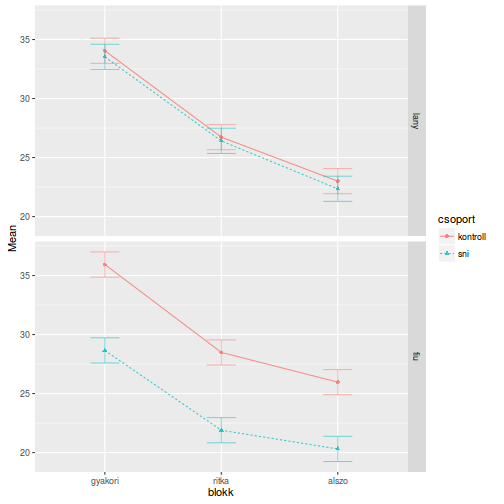
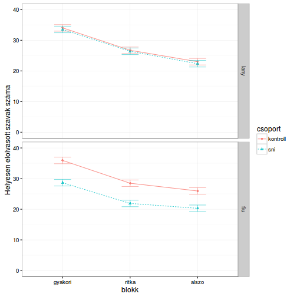

# ANOVA: Az *ez* csomag

Tegyük fel, hogy az olvasásvizsgálati adatokat egy újabb szempont szeretnénk elemezni: arra vagyunk kíváncsiak, hogy az olvasási alteszt három blokkjában 
(gyakori szavak, ritka szavak, értelmetlen szavak) mért teljesítmény szignifikánsan különbözik-e egymástól, és módosítja-e ezt a hatást a csoport (kontroll/sni) és a nem (fiú/lány). Ez a kérdés tehát egy klasszikus ismételt méréses varianciaanalízis futtatását igényli két between-subject (nem és csoport) és egy within subject (blokk) faktorral. (Alkalmazhatnánk kevert-hatás modellt is, erről lásd a következő fejezetet.)

Faktoriális kísérletek elemzésére nagyon kényelmes az [ez](https://cran.r-project.org/web/packages/ez/index.html) csomag. A következőkben ezen csomag használatát mutatjuk be. (Szintén nagyon ajánlott az [afex](https://cran.r-project.org/web/packages/afex/index.html) csomag is, lásd az utolsó fejezet esettanulmányát.)

- kezdeti lépések: csomag betöltése + adatok betöltése

```r
# csomag betöltése
library(ez)

# adatok betöltése
data(dyslex)
```

- adatok szűrése és 'long' formátumúvá alakítása:

```r
# szűrés és releváns változók kiválasztása
dat <- subset(dyslex, 
              oszt <= 4, 
              select = c(id, nem, csoport,
                         olv_helyes1:olv_helyes3)
              )

# 'long' formátum
dat <- reshape(dat, 
               varying = c("olv_helyes1", "olv_helyes2", "olv_helyes3"),
               v.names = "helyes_szavak",
               timevar = "blokk", 
               times = c("gyakori", "ritka", "alszo"),
               direction = "long")
dat$id <- factor(dat$id)
dat$blokk <- factor(dat$blokk, levels = c("gyakori", "ritka", "alszo"))
```

- modell megadása (a változók neveit nem kötelező idézőjelbe tennünk, azaz megadhatjuk karakter vektorként és szimbólumként is): 

```r
model <- ezANOVA(dat, 
                 dv = "helyes_szavak", # karakter vektorként
                 wid = id,             # szimbólumként
                 within = blokk,
                 between = .(csoport, nem),
                 observed = .(csoport, nem))
```

```
## Warning: Data is unbalanced (unequal N per group). Make sure you specified
## a well-considered value for the type argument to ezANOVA().
```

- eredmények:

```r
print(model)
```

```
## $ANOVA
##              Effect DFn DFd           F            p p<.05          ges
## 2           csoport   1  93   6.7328288 1.099811e-02     * 0.0569494297
## 3               nem   1  93   0.1257158 7.237188e-01       0.0010633630
## 5             blokk   2 186 179.9551287 3.254072e-44     * 0.1920025109
## 4       csoport:nem   1  93   3.4493884 6.643999e-02       0.0291765478
## 6     csoport:blokk   2 186   0.3630537 6.960409e-01       0.0004794060
## 7         nem:blokk   2 186   1.8547382 1.593766e-01       0.0024491494
## 8 csoport:nem:blokk   2 186   0.3328531 7.173016e-01       0.0004395267
## 
## $`Mauchly's Test for Sphericity`
##              Effect         W            p p<.05
## 5             blokk 0.8213475 0.0001170145     *
## 6     csoport:blokk 0.8213475 0.0001170145     *
## 7         nem:blokk 0.8213475 0.0001170145     *
## 8 csoport:nem:blokk 0.8213475 0.0001170145     *
## 
## $`Sphericity Corrections`
##              Effect       GGe        p[GG] p[GG]<.05       HFe
## 5             blokk 0.8484265 6.254740e-38         * 0.8625342
## 6     csoport:blokk 0.8484265 6.610856e-01           0.8625342
## 7         nem:blokk 0.8484265 1.658714e-01           0.8625342
## 8 csoport:nem:blokk 0.8484265 6.816167e-01           0.8625342
##          p[HF] p[HF]<.05
## 5 1.626197e-38         *
## 6 6.646058e-01          
## 7 1.652863e-01          
## 8 6.852199e-01
```

- ábrázolás:

```r
model_plot <- ezPlot(dat, 
                     dv = helyes_szavak, 
                     wid = id, 
                     within = blokk,
                     between = .(csoport, nem), 
                     x = blokk, 
                     split = csoport, 
                     row = nem)
```

```
## Warning: Data is unbalanced (unequal N per group). Make sure you specified
## a well-considered value for the type argument to ezANOVA().
```

```
## Warning in ezStats(data = data, dv = dv, wid = wid, within = within,
## within_full = within_full, : Unbalanced groups. Mean N will be used in
## computation of FLSD
```

```
## Warning: `show_guide` has been deprecated. Please use `show.legend`
## instead.
```

```r
# táblázat a becsült átlagokról
model_plot$data
```

```
##     csoport  nem   blokk  N     Mean        SD     FLSD       lo       hi
## 1  kontroll lany gyakori 22 34.04545 10.330156 2.132509 32.97920 35.11171
## 2  kontroll lany   ritka 22 26.72727  7.977240 2.132509 25.66102 27.79353
## 3  kontroll lany   alszo 22 23.00000  6.510065 2.132509 21.93375 24.06625
## 4  kontroll  fiu gyakori 29 35.93103  8.692900 2.132509 34.86478 36.99729
## 5  kontroll  fiu   ritka 29 28.48276  7.688678 2.132509 27.41650 29.54901
## 6  kontroll  fiu   alszo 29 25.96552  6.689452 2.132509 24.89926 27.03177
## 7       sni lany gyakori 17 33.52941 11.297774 2.132509 32.46316 34.59567
## 8       sni lany   ritka 17 26.41176  9.766389 2.132509 25.34551 27.47802
## 9       sni lany   alszo 17 22.35294  7.516159 2.132509 21.28669 23.41920
## 10      sni  fiu gyakori 29 28.65517  9.024870 2.132509 27.58892 29.72143
## 11      sni  fiu   ritka 29 21.89655  7.961267 2.132509 20.83030 22.96281
## 12      sni  fiu   alszo 29 20.31034  7.309990 2.132509 19.24409 21.37660
```

```r
# ábra
print(model_plot)
```



```r
# ggplot ábráról van szó, tehát tetszőlegesen módosíthatjuk
library(ggplot2)
model_plot + 
    ylab("Helyesen elolvasott szavak száma") + 
    ylim(0, 40) + 
    theme_bw()
```



