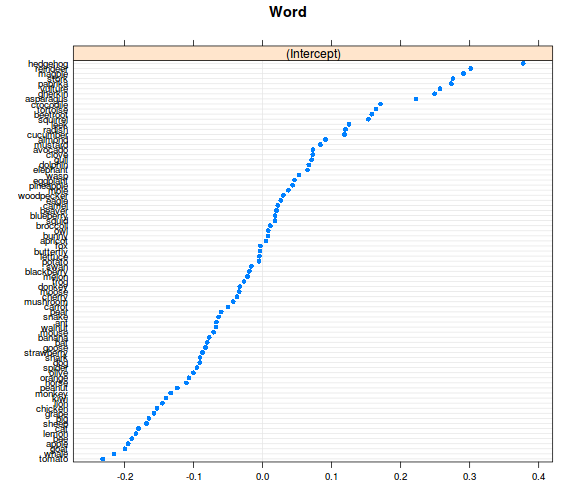
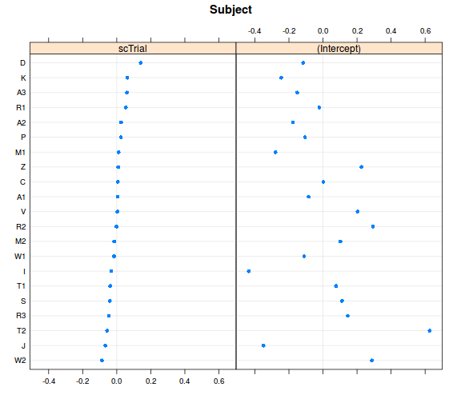
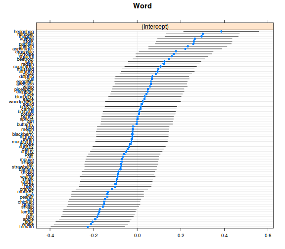

# Modellépítés / modellszelekció


- optimális eset: elméletvezérelt modellépítés
- gyakoribb eset: adatvezérelt modellépítés
- döntési pontok: fix hatások és random hatások, random hatáson belül random konstans és random slope -> kevés változó esetén is nagyon komplex lehet!

### Javaslatok
- inkább haladjunk a bővebb modell felől
- először random hatások, utána fix hatások tesztelése
- a random hatásoknál érdemes a maximális struktúrát megtartani (feltéve, hogy konvergál) 
- a random hatásokat REML, a fix hatásokat ML becsléssel teszteljük (a végső modell paramétereit REML becsléssel számoljuk)
- a modellszelekció történhet likelihoodarány-teszttel vagy pl. AIC-értékek összevetésével
- ha két fix hatás interakciója szerepel a modellben, akkor mindig vegyük be a főhatásokat is, illetve szerepeltessük az interakciót a random struktúrában is


### Példa
#### Egy lehetséges induló modell
- modellezzük a válaszidőt (RT) a próba sorszáma (scTrial) és a személy anyanyelve, illetve a szó szemantikai kategóriája alapján 

```r
( model_full <- lmer(scRT ~ scTrial + NativeLanguage*Class + 
                         (1 + scTrial | Subject) + 
                         (1 | Page) + (1 | Word), 
                     data = lexdec_corr) )
```

```
## Linear mixed model fit by REML ['lmerMod']
## Formula: 
## scRT ~ scTrial + NativeLanguage * Class + (1 + scTrial | Subject) +  
##     (1 | Page) + (1 | Word)
##    Data: lexdec_corr
## REML criterion at convergence: 2241.777
## Random effects:
##  Groups   Name        Std.Dev. Corr 
##  Word     (Intercept) 0.21336       
##  Subject  (Intercept) 0.34583       
##           scTrial     0.08236  -0.40
##  Page     (Intercept) 0.81001       
##  Residual             0.44491       
## Number of obs: 1594, groups:  Word, 79; Subject, 21; Page, 10
## Fixed Effects:
##            (Intercept)                 scTrial         NativeLanguage1  
##               0.040898               -0.025103               -0.216326  
##                 Class1  NativeLanguage1:Class1  
##               0.006458               -0.027721
```

- örök FAQ: miért nem számol az lmer p-értékeket?: [ezért](https://stat.ethz.ch/pipermail/r-help/2006-May/094765.html)

- az lmer outputja a regressziós modellek outputjának formátumát követi; mit tegyünk, ha mi ANOVA-stílusú táblázatot szeretnénk?

```r
library(car)
```

```
## 
## Attaching package: 'car'
```

```
## The following object is masked from 'package:psych':
## 
##     logit
```

```r
Anova(model_full)
```

```
## Analysis of Deviance Table (Type II Wald chisquare tests)
## 
## Response: scRT
##                       Chisq Df Pr(>Chisq)   
## scTrial              1.3918  1    0.23811   
## NativeLanguage       9.0338  1    0.00265 **
## Class                0.0056  1    0.94042   
## NativeLanguage:Class 5.9135  1    0.01503 * 
## ---
## Signif. codes:  0 '***' 0.001 '**' 0.01 '*' 0.05 '.' 0.1 ' ' 1
```

```r
Anova(model_full, test.statistic = "F")
```

```
## Note: method with signature 'sparseMatrix#ANY' chosen for function 'kronecker',
##  target signature 'dgCMatrix#ngCMatrix'.
##  "ANY#sparseMatrix" would also be valid
```

```
## Analysis of Deviance Table (Type II Wald F tests with Kenward-Roger df)
## 
## Response: scRT
##                           F Df  Df.res   Pr(>F)   
## scTrial              1.3914  1   25.61 0.249014   
## NativeLanguage       8.6147  1   24.93 0.007066 **
## Class                0.0056  1   68.74 0.940687   
## NativeLanguage:Class 5.9097  1 1482.68 0.015176 * 
## ---
## Signif. codes:  0 '***' 0.001 '**' 0.01 '*' 0.05 '.' 0.1 ' ' 1
```

```r
# az SPSS és SAS a Type III felbontást részesítik előnyben
Anova(model_full, type = 3)
```

```
## Analysis of Deviance Table (Type III Wald chisquare tests)
## 
## Response: scRT
##                       Chisq Df Pr(>Chisq)   
## (Intercept)          0.0232  1   0.878967   
## scTrial              1.3918  1   0.238109   
## NativeLanguage       8.8816  1   0.002881 **
## Class                0.0490  1   0.824884   
## NativeLanguage:Class 5.9135  1   0.015025 * 
## ---
## Signif. codes:  0 '***' 0.001 '**' 0.01 '*' 0.05 '.' 0.1 ' ' 1
```

- egyéb csomagok p-értékek korrekt kinyerésére: [afex](https://cran.r-project.org/web/packages/afex/index.html), [lmerTest](https://cran.r-project.org/web/packages/lmerTest/index.html)

#### Random hatások tesztelése
- elsősorban akkor szükséges, ha túl komplex az induló modell, és/vagy szélsőséges értékek szerepelnek a varianca-kovariancia mátrixban (pl. 1 vagy -1 közeli korreláció és/vagy 0 szórás)
- az `anova.merMod` függvény használható, de valószínűleg túl konzervatív (szélsőséges esetben akár 2-szerese a p-érték a valósnak)
- használhatjuk az AIC (vagy BIC) kritériumot is

```r
# modellek illesztése
( model_r1 <- lmer(scRT ~ scTrial + NativeLanguage*Class + 
                       (1 | Subject) + (0 + scTrial | Subject) + 
                       (1 | Page ) + (1 | Word), 
                   data = lexdec_corr) )
```

```
## Linear mixed model fit by REML ['lmerMod']
## Formula: scRT ~ scTrial + NativeLanguage * Class + (1 | Subject) + (0 +  
##     scTrial | Subject) + (1 | Page) + (1 | Word)
##    Data: lexdec_corr
## REML criterion at convergence: 2244.127
## Random effects:
##  Groups    Name        Std.Dev.
##  Word      (Intercept) 0.2131  
##  Subject   scTrial     0.0822  
##  Subject.1 (Intercept) 0.3466  
##  Page      (Intercept) 0.8099  
##  Residual              0.4449  
## Number of obs: 1594, groups:  Word, 79; Subject, 21; Page, 10
## Fixed Effects:
##            (Intercept)                 scTrial         NativeLanguage1  
##               0.039000               -0.025158               -0.202039  
##                 Class1  NativeLanguage1:Class1  
##               0.006174               -0.027649
```

```r
( model_r2 <- lmer(scRT ~ scTrial + NativeLanguage*Class + 
                       (1 | Subject) + (1 | Page ) + (1 | Word), 
                   data = lexdec_corr) )
```

```
## Linear mixed model fit by REML ['lmerMod']
## Formula: scRT ~ scTrial + NativeLanguage * Class + (1 | Subject) + (1 |  
##     Page) + (1 | Word)
##    Data: lexdec_corr
## REML criterion at convergence: 2267.476
## Random effects:
##  Groups   Name        Std.Dev.
##  Word     (Intercept) 0.2126  
##  Subject  (Intercept) 0.3464  
##  Page     (Intercept) 0.8112  
##  Residual             0.4521  
## Number of obs: 1594, groups:  Word, 79; Subject, 21; Page, 10
## Fixed Effects:
##            (Intercept)                 scTrial         NativeLanguage1  
##               0.038255               -0.024362               -0.200384  
##                 Class1  NativeLanguage1:Class1  
##               0.006651               -0.029426
```

```r
( model_r3 <- lmer(scRT ~ scTrial + NativeLanguage*Class + 
                       (1 | Subject) + (1 | Page ), 
                   data = lexdec_corr) )
```

```
## Linear mixed model fit by REML ['lmerMod']
## Formula: scRT ~ scTrial + NativeLanguage * Class + (1 | Subject) + (1 |  
##     Page)
##    Data: lexdec_corr
## REML criterion at convergence: 2417.197
## Random effects:
##  Groups   Name        Std.Dev.
##  Subject  (Intercept) 0.3442  
##  Page     (Intercept) 0.8144  
##  Residual             0.4922  
## Number of obs: 1594, groups:  Subject, 21; Page, 10
## Fixed Effects:
##            (Intercept)                 scTrial         NativeLanguage1  
##               0.030674               -0.022950               -0.196803  
##                 Class1  NativeLanguage1:Class1  
##               0.005177               -0.030565
```

```r
# modellek összevetése
anova(model_r3, model_r2, model_r1, model_full, refit = FALSE)
```

```
## Data: lexdec_corr
## Models:
## model_r3: scRT ~ scTrial + NativeLanguage * Class + (1 | Subject) + (1 | 
## model_r3:     Page)
## model_r2: scRT ~ scTrial + NativeLanguage * Class + (1 | Subject) + (1 | 
## model_r2:     Page) + (1 | Word)
## model_r1: scRT ~ scTrial + NativeLanguage * Class + (1 | Subject) + (0 + 
## model_r1:     scTrial | Subject) + (1 | Page) + (1 | Word)
## model_full: scRT ~ scTrial + NativeLanguage * Class + (1 + scTrial | Subject) + 
## model_full:     (1 | Page) + (1 | Word)
##            Df    AIC    BIC  logLik deviance    Chisq Chi Df Pr(>Chisq)
## model_r3    8 2433.2 2476.2 -1208.6   2417.2                           
## model_r2    9 2285.5 2333.8 -1133.7   2267.5 149.7210      1  < 2.2e-16
## model_r1   10 2264.1 2317.9 -1122.1   2244.1  23.3489      1  1.351e-06
## model_full 11 2263.8 2322.9 -1120.9   2241.8   2.3499      1     0.1253
##               
## model_r3      
## model_r2   ***
## model_r1   ***
## model_full    
## ---
## Signif. codes:  0 '***' 0.001 '**' 0.01 '*' 0.05 '.' 0.1 ' ' 1
```

```r
# AIC
AIC(model_r3, model_r2, model_r1, model_full)
```

```
##            df      AIC
## model_r3    8 2433.197
## model_r2    9 2285.476
## model_r1   10 2264.127
## model_full 11 2263.777
```

```r
# BIC
BIC(model_r3, model_r2, model_r1, model_full)
```

```
##            df      BIC
## model_r3    8 2476.189
## model_r2    9 2333.842
## model_r1   10 2317.867
## model_full 11 2322.891
```

#### Random hatások ellenőrzése
- BLUP (best linear unbiased predictor) -> Douglas Bates inkább a "conditional mode of random effects" megfogalmazást preferálja
- a legjobb, ha a feltételes variancia-kovariancia mátrixot is kérjük, de ez többtagú random hatásoknál egyelőre nem működik

```r
ranefs <- ranef(model_r1, condVar = TRUE)
```

```
## Warning in ranef.merMod(model_r1, condVar = TRUE): conditional variances
## not currently available via ranef when there are multiple terms per factor
```

```r
library(lattice) # az ábrázoláshoz betöltjük a lattice csomagot
dotplot(ranefs)
```

```
## $Word
```



```
## 
## $Subject
```



```
## 
## $Page
```


```r
# ennél a modellnél stimmel a dolog
ranefs_vcov <- ranef(model_r2, condVar = TRUE)
dotplot(ranefs_vcov)
```

```
## $Word
```



```
## 
## $Subject
```


```
## 
## $Page
```


- összességében azt látjuk, hogy a random hatások valóban számottevő mértékűek
- ellenőrizzük a reziduálisokat (normál eloszlásúak-e, van-e szélsőséges érték):

```r
resids <- scale(residuals(model_r1))
par(mfrow = c(1, 2))
hist(resids)  # sima hisztogram
qqnorm(resids)  # Q-Q ábra a normalitás ellenőrzésére
qqline(resids)
```


- a reziduálisok alapján megfontolandó lenne, hogy a válaszidők logaritmusa helyett azok inverz transzformáltjával számoljunk, vagy esetleg zárjuk ki azokat az eseteket, amelyeknél a standardizált reziduális túllép egy bizonyos értéket (pl. 2,5-öt)
- válasszuk ki a végső modellt

```r
model_ranef_final <- model_r1
```


#### Fix hatások tesztelése
- a legkényelmesebb módszer: best subset; FIGYELEM, ésszel használjuk!!!
- mivel most a fix hatásokat teszteljük, sima ML becslést (nem pedig REML-t) kell alkalmazni

```r
library(MuMIn)
options(na.action = "na.fail") # ez kell, különben a dredge fv. panaszkodik

# Alapesetben az ML megoldható az update() függvénnyel
model_ranef_final_ml <- update(model_ranef_final, REML = FALSE)

# Modellek illesztése
( fixmodels <- dredge(model_ranef_final_ml) )
```

```
## Fixed term is "(Intercept)"
```

```
## Global model call: lmer(formula = scRT ~ scTrial + NativeLanguage * Class + (1 | 
##     Subject) + (0 + scTrial | Subject) + (1 | Page) + (1 | Word), 
##     data = lexdec_corr, REML = FALSE)
## ---
## Model selection table 
##      (Int) Cls NtL      scT Cls:NtL df    logLik   AICc delta weight
## 12 0.03892   +   +                +  9 -1111.577 2241.3  0.00  0.357
## 16 0.03894   +   + -0.02514       + 10 -1110.866 2241.9  0.60  0.264
## 3  0.03982       +                   7 -1114.508 2243.1  1.82  0.144
## 7  0.03980       + -0.02502          8 -1113.814 2243.7  2.45  0.105
## 4  0.03954   +   +                   8 -1114.504 2245.1  3.83  0.053
## 8  0.03956   +   + -0.02500          9 -1113.811 2245.7  4.47  0.038
## 1  0.01047                           6 -1117.676 2247.4  6.14  0.017
## 5  0.01047         -0.02503          7 -1116.980 2248.0  6.76  0.012
## 2  0.01018   +                       7 -1117.673 2249.4  8.15  0.006
## 6  0.01022   +     -0.02502          8 -1116.978 2250.0  8.78  0.004
## Models ranked by AICc(x) 
## Random terms (all models): 
## '1 | Subject', '0 + scTrial | Subject', '1 | Page', '1 | Word'
```
- az eredmények azt mutatják, hogy a Trial változónk hatása nem szignifikáns, és erősen határeset a Class főhatása és a NativaLanguage X Class interakció is
- tegyuk fel, hogy az scTrial-t kontrollváltozóként mindenképpen szerepeltetni akarjuk, és kérjük a BIC kritériumot is

```r
( fixmodels2 <- dredge(model_ranef_final_ml, 
                       rank = "AIC", extra = "BIC", fix = "scTrial") )
```

```
## Fixed terms are "scTrial" and "(Intercept)"
```

```
## Global model call: lmer(formula = scRT ~ scTrial + NativeLanguage * Class + (1 | 
##     Subject) + (0 + scTrial | Subject) + (1 | Page) + (1 | Word), 
##     data = lexdec_corr, REML = FALSE)
## ---
## Model selection table 
##     (Int) Cls NtL      scT Cls:NtL  BIC df    logLik    AIC delta weight
## 8 0.03894   +   + -0.02514       + 2295 10 -1110.866 2241.7  0.00  0.628
## 3 0.03980       + -0.02502         2287  8 -1113.814 2243.6  1.90  0.244
## 4 0.03956   +   + -0.02500         2294  9 -1113.811 2245.6  3.89  0.090
## 1 0.01047         -0.02503         2286  7 -1116.980 2248.0  6.23  0.028
## 2 0.01022   +     -0.02502         2293  8 -1116.978 2250.0  8.22  0.010
## Models ranked by AIC(x) 
## Random terms (all models): 
## '1 | Subject', '0 + scTrial | Subject', '1 | Page', '1 | Word'
```


#### Fix hatások ábrázolása
- az effects package mindenféle modellre (köztük a merMod modellekre is) tud ábrát készíteni

```r
library(effects)
effs <- allEffects(model_ranef_final)
plot(effs)
```

```
## 
## Attaching package: 'effects'
```

```
## The following object is masked from 'package:car':
## 
##     Prestige
```


